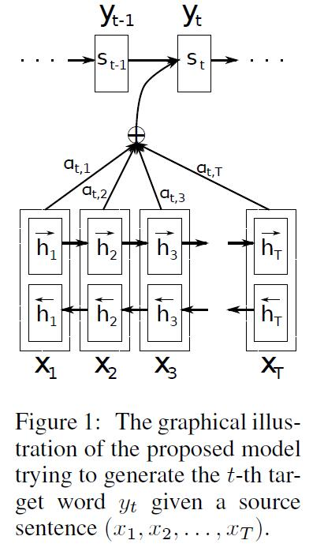
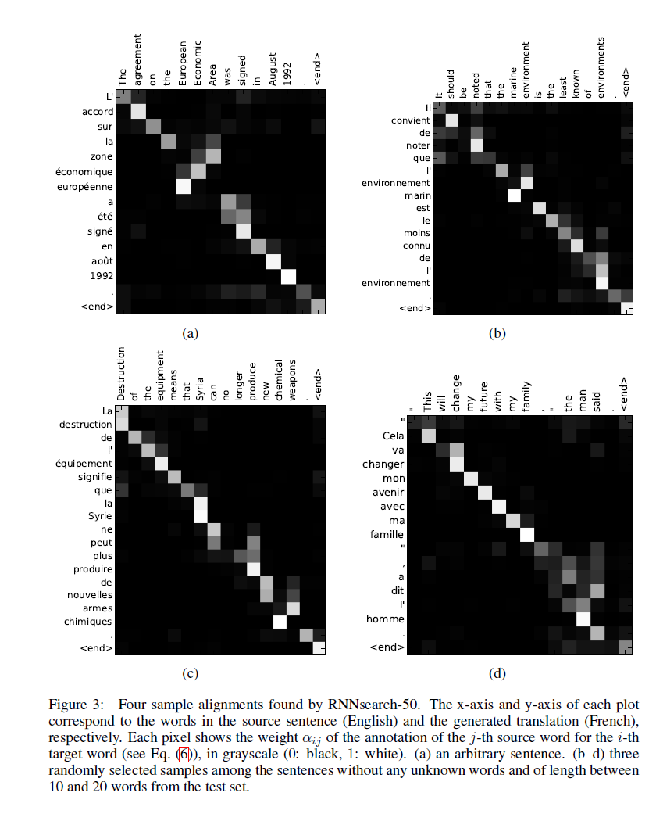

**Neural Machine Translation By Jointly Learning to align and translate**

期刊：ICIR 2015

引用量：21250

---

# 概要

**神经机器翻译（neural machine Translation）**是最近提出的一种机器翻译方法。与传统的**统计机器翻译（statistic machine translation）**不同，神经机器翻译的目标是建立一个单一的神经网络，可以联合调优，以实现翻译性能的最大化。==最近提出的用于神经机器翻译的模型通常属于编码器解码器家族（a family of encoder-decoders)，它将源句编码成一个固定长度的向量，解码器从中生成翻译==。==在本文中,我们臆测使用一个固定长度的向量，在提高基本的 encoder-decoder 框架的性能方面，是一个瓶颈==。==提出了一种上面方法的扩展，即通过允许一个模型自动的（软）搜索源句子中与预测一个目标词相关的部分，而不是显式地必须将这些部分当做一个硬部分来进行构建==。采用这种新方法，我们的翻译性能在英法翻译任务上可与目前最先进的基于短语（phrase-based）的系统相媲美。此外，定性分析（qualitative analysis）表明，模型发现的(软)对齐与我们的直觉一致。

# 1. 引入

神经机器翻译是一种新兴的机器翻译方法，最近由Kalchbrenner和Blunsom (2013)， Sutskever等人(2014)和Cho等人(2014b)提出。传统的基于短语的翻译系统(见Koehn等人，2003年)需要很多小子组件，这些子组件分别微调。与上面传统的基于短语的翻译系统不同的是，神经机器翻译试图构建和训练一个单一的、大型的神经网络来阅读句子并输出正确的译文。

大多数提出的神经机器翻译模型属于 encoder-decoder 家族(Sutskever et al.， 2014;Cho等人，2014a)，为每一种语言配备一个编码器和一个解码器，或者包含一个特定于语言的编码器应用于每个句子，然后比较其输出(Hermann和Blunsom, 2014)。编码器神经网络读取源句并将其编码到一个定长向量中。解码器然后从编码后的向量输出翻译。整个编码器-解码器系统，由一个语言对的编码器和解码器组成，联合训练以最大限度地提高给定源句子的正确翻译概率。

这种编码器-解码器方法的一个潜在问题是，神经网络需要能够将源句子的所有必要信息压缩为一个固定长度的向量。这可能会使神经网络难以处理长句子，特别是那些比训练语料库中的句子长。Cho等人(2014b)的研究表明，随着输入句子长度的增加，基本编码器-解码器的性能确实会迅速下降。

==为了解决这个问题，我们引入了对编码器-解码器模型的扩展，该模型学习联合对齐和翻译。我们的模型在翻译中每生成一个词，它就会(软-)搜索源句子中最相关信息集中的一组位置。然后，该模型根据与这些源位置相关的上下文向量以及之前生成的所有目标词预测当前的目标词。==

这种方法与基本的编码器-解码器最重要的区别是，它不试图将整个输入句子编码到一个固定长度的向量中。相反，它将输入的句子编码成一个向量序列，并在解码翻译时自适应地选择这些向量的子集。这样一来，神经翻译模型就不必再把源句子的所有信息(无论其长度如何)压缩成一个固定长度的向量。我们证明这使得模型能更好地处理长句子。

在这篇文章中。我们表明，提出的联合学习对齐和翻译的方法比基本的编码器-解码器方法显著提高了翻译性能。这种改善在长句子中更为明显，但可以用任何长度的句子来观察。在英法翻译的任务上，用单一模型实现所提出的方法，其翻译性能可与传统的基于短语的翻译系统相媲美或接近。此外，定性分析表明，所提出的模型在源句和相应的目标句之间找到了语言学上貌似可信的(软)对齐。

# 2. 背景：神经机器翻译

从概率的角度来看，翻译相当于给定源句x，找到一个目标句y，使y的条件概率最大化，也即 $argmax_{y}p(y|x)$ 。在神经机器翻译中，我们利用并行训练语料库拟合参数化模型，以最大限度地提高句子对的条件概率。一旦翻译模型学习了条件分布，给定源句，就可以通过搜索条件概率最大的句子来生成相应的译文。

最近，一些论文提出使用神经网络直接学习这种条件分布(见，例如Kalchbrenner和Blunsom, 2013;赵等人，2014a;Sutskever等人，2014;赵等人，2014b;Forcada和N eco, 1997)。这种神经机器翻译方法通常由两个部分组成，第一个部分编码源句x，第二个解码为目标句y。例如，两个递归神经网络(RNN)被(Cho等人，2014a)和(Sutskever等人）使用，他们将可变长的源句（variable-length source sentence）编码为定长向量（fixed-length vector)，并将定长向量解码为变长目标句（variable-length target sentence)。

尽管神经机器翻译是一种很新的方法，但它已经显示出了很好的结果。Sutskever等人(2014)报道，基于具有长短期记忆(LSTM)单元的 RNN 的神经机器翻译在英语-法语翻译任务上达到了接近传统基于短语的机器翻译系统的最先进性能[^1]。在现有的翻译系统中添加神经组件，例如，为短语表（phrase talbe）中的短语对（phrase pairs）评分(Cho等人，2014a)或对候选翻译重新排序(Sutskever等人，2014)，这些方法被承认了出已经超越之前的最先进的性能水平。

## 2.1 RNN encoder-decoder

在这里，我们简要描述了底层框架，称为RNN编码器-解码器，其由Cho等人(2014a)和Sutskever等人(2014)提出。在此基础上，我们构建了一个新框架，它可以同时学习对齐和翻译。

在 Encoder-Decoder 框架中， encoder 读取输入序列，即一个向量序列 $x = (x_{1},\cdot\cdot\cdot,h_{t-1})$ ，转化成一个向量 $c$ [^2]。最常用的方法是使用RNN：【公式1】
$$
\begin{equation}
\label{1}
h_{t} = f(x_{t},h_{t-1}) 
\end{equation}
$$
和
$$
\begin{equation}c = q({h_1,\cdot\cdot\cdot},h_{T_{x}})\end{equation}
$$
其中，$$h_t \in \mathbb{R}^n $$ 是在时刻 $t$ 的隐状态，$c$ 是从隐状态序列中生成的向量。$f$ 和 $q$ 是一些非线性函数。例如Sutskever et al. (2014)使用 LSTM 作为 $f$ ，并且 $q(\lbrace{h_1,\cdot\cdot\cdot,h_T}\rbrace)=h_T$ 。

decoder通常训练，用于在给定上下文向量 $c$ 和所有之前预测的词 $\lbrace{y_1,\cdot\cdot\cdot, y_{t'-1}}\rbrace$ 。换句话说，解码器通过将联合概率分解为有序条件来定义译文 $y$ 的概率：【公式2】
$$
p(y)=\prod_{t=1}^Tp(y_t \mid y_1,\cdot\cdot\cdot,y_{t-1},c),
$$
其中， $y=(y_1, \cdot\cdot\cdot,y_{T_{y}})$ 。对于RNN，每一个条件概率建模为：【公式3】
$$
p(y_t\mid\lbrace y_1,\cdot\cdot\cdot,y_{t-1}\rbrace,c)=g(y_{t-1},s_t,c)
$$
其中 $g$ 是一个非线性的，潜在的，多层的函数，输出 $y_t$ 的概率，$s_t$ 是 RNN 的隐状态。值得注意的是，可以使用其它框架，如一个RNN和一个去卷积神经网络的混合。

# 3. 学习对齐和翻译

在这一节中，我们提出了一种新奇的框架用于神经机器翻译。新框架包含一个双向的RNN，用于一个encoder(3.2节)，还包含一个decoder，其在解码一段翻译时模仿搜索一个源句子。

## 3.1 Decoder：一般说明

在一个新的模型框架中，我们在公式（2）中定义了每个条件概率：【公式4】
$$
p(y_i\mid{y_1,\dots,}y_{i-1},x) = g(y_{i-1},s_i, c_i),
$$
其中，$s_i$ 是 RNN 在时刻 $i$ 的隐状态，通过下面的公式计算：
$$
s_i=f(s_{i-1},y_{i-1},c_i)
$$
值得注意的是不像已经存在的encoder-decoder方法（看公式（2）），对每一个目标词 $y_i$ 来说，概率受限于一个独特的上下文向量 $c_i$ 。

上下文向量 $c_i$ 依赖于一个注解序列 $(h_1,\cdot\cdot\cdot, h_{T_{x}})$ ，该注释序列是由 encoder 将输入句子（input sentence）映射过去的。每个注释（annotation） $h_i$ 包含了信息。该信息有关整个输入序列和对输入序列的第 $i$ 个单词周围部分的一个强关注。我们将在下一节详细解释注释是如何计算的。

上下文向量 $c_{i}$ 是通过对这些注释 $h_{i}$ 的加权求和计算的：【公式5】
$$
c_{i} = \sum_{j=1}^{T_{x}}\alpha_{ij}h_{j}.
$$
每个注释 $h_j$ 的权重 $\alpha_{ij}$ 通过下面公式计算：【公式6】
$$
\alpha_{ij}=\frac{exp(e_{ij})}{\sum_{k=1}^{T_{x}}exp(e_{ik})}
$$
其中，
$$
e_{ij}=a(s_{i-1}, h_{j})
$$
是一个对齐模型，它对==位置 $j$ 周围的输入== 和 ==位置 $i$== 匹配的有多好进行打分。分数基于 RNN 隐状态 $s_{i-1}$ （仅仅算出 $y_{i}$ 之前，公式（4）），和输入句子的第 $j$ 个注释 $h_{j}$ 。

我们将对齐模型 $a$ 作为一个前馈神经网络参数化，并与所有提出的系统其它组件联合训练。不像传统的机器翻译没有考虑对齐为一个潜在的变量。相反，对齐模型直接计算了一个软对齐，其允许代价函数的梯度反向传播通过。梯度也可以用来联合训练对齐模型 和 整个翻译模型。

我们可以将所有注释的加权和理解为计算 *预期* 注释的方法，其中预期是可能的对齐。假设 $\alpha_{ij}$ 是目标词 $y_{i}$ 对齐到、或翻译于一个源词 $x_j$ 的概率。那么，第 $i$ 个上下文向量 $c_{i}$ 是所有概率为 $\alpha_{ij}$ 的注释之上的期待的注释。

概率 $\alpha_{ij}$ ，或它的相关的能量 $e_{ij}$ 反映了注释 $h_{j}$ 相对于 之前的隐状态 $s_{i-1}$ 在决定下个状态 $s_{i}$ 和 生成 $y_{i}$ 的重要性。直观上，其在decoder上实现了注意力机制。decoder决定了源句子中需要注意的部分。通过使 decoder 有一个注意力机制，我们缓解了encoder必须将源句子的所有信息编码到一个固定长度的向量这一压力。通过这种新方法，信息可以分布在注释序列（sequence of annotations）中，这可以被decoder相应选择性的提取。

## 3.2 Encoder：对序列进行注解的双向RNN

常规的RNN，如公式（1）所描述的，顺序的读取输入序列 $x$ ，从 第一个符号 $x_{1}$ 到最后一个符号 $x_2$ 。然而，在提出的模式中，我们想让每个词的注解不仅要总结前面的词，还要总结后面的词。因此，我们提出要使用一个双向的RNN（BiRNN，Schuster and Paliwal, 1997)，它最近已经成功地用于语音识别(参见，例如Graves等人，2013年)。

一个 BiRNN 包含前向和反向的 RNN。前向的RNN $\overrightarrow{f}$ 按顺序（从 $x_{1}$ 到 $x_{T_{x}}$ ）读取输入序列，并且计算出一个前向隐状态序列（$\overrightarrow{h_{1}},\cdot\cdot\cdot,\overrightarrow{h_{T_{x}}}$）。反向RNN $\overleftarrow{f}$ 以反向的顺序读取序列（从 $x_{T_{x}}$ 到 $x_{1}$ ），得到一个反向隐状态序列 $(\overleftarrow{h_{1}},\cdot\cdot\cdot,\overleftarrow{h_{T_{x}}})$ 。

我们通过连接 词 $x_{j}$ 的前向隐状态 $\overrightarrow{h_{j}}$ 和后向隐状态 $\overrightarrow{h_{j}}$ ，来获取每个词 $x_{j}$ 的注解（annotation），也即，$h_{j}=[\overrightarrow{h_{j}^{T}};\overleftarrow{h_{j}^{T}}]^{T}$ 。通过这种方式，注释 $h_{j}$ 包含了对前面所有词和后面所有词的总结。由于RNN有更好的代表最近输入的倾向。注释 $h_{j}$ 将被 $x_{j}$ 周围的词所关注。Decoder和对齐模型使用注释序列，稍后用于计算上下文向量（context vector）（等式5-6）。

图1是对提出模型的图像描述。

# 4. 实验设置

我们在英语-法语翻译（English-to-French translation）任务上评估了我们提出的方法。我们使用了由 ACL WMT'14[^3] 所提供的 双语平行语料（parallel corpora）。我们也报告了一个RNN Encoder-Decoder的性能作为比较，该模型是由Cho 等(2014a)提出来的。对于两种模型，我们使用了相同的训练步骤和相同数据集[^4]。

## 4.1 数据集

WMT'14 包含下面的英语-法语平行语料：Europarl（61M 词，英国议会会议记录，Europe Parliament），news commentary（5.5M，新闻评论），UN（421M，联合国），以及两个爬取的语料，分别为90M和272.5M词。总共850M词。遵循Cho等（2014a）描述的步骤，使用Axelrod等（2011）[^5]的数据选择方法，将联合语料减少到348M词。尽管可以使用一个更大的单语语料去预训练一个encoder，但是除了上面提到的平行语料，我们不使用任何单语数据。我们将 news-test-2012 和 news-test-2013 连接到一起做开发（验证）集，并且模型在测试集（news-test-2014，源于WMT' 14）上进行评估，测试集包含 3003 个没有在训练数据中出现的句子。

在一个常规的分词（tokenization）后[^6]，我们使用了每种语言中最频繁的30,000个单词组成的名单去训练我们的模型。任何不包含在名单中的词都映射到一个特殊的token（[UNK]）。我们没有应用任何其他的特殊预处理，例如对数据小写（lowercasing）或词干化（stemming，【译者注：如神经网络对“ant”和“ants”两个单词会习得相似的词向量。词干化就是去除词缀得到词根的过程。】）

## 4.2 模型

我们训练了两类模型。第一种是 RNN Encoder-Decoder（==**RNNencdec**==, Cho et al.,2014a)，第二种是我们提出的模型，我们称之为==**RNNsearch**==。我们训练每个模型两次：首先用长度不超过30个字的句子训练（RNNencdec-30，RNNsearch-30），然后用长度多达50个词的句子训练（RNNencdec-50，RNNsearch-50）。

RNNencdec的 encoder 和 decoder 各有1000个隐藏单元[^7]。RNNsearch的 encoder 包含前向和反向循环神经网络（RNN），每个网络有1000个隐藏单元。它的decoder有1000个隐藏单元。在这两种情况下，我们使用了一个多层网络来计算每个目标词的条件概率（Pascanu等，2014），这个多层网络带有一个单maxout（Goodfellow 等，2013）隐藏层。

我们使用一种小批量随机梯度（minibatch SGD）算法 和 Adadelta 来训练每个模型。每个 SGD的更新方向是使用80个句子的小批量计算的。我们训练每个模型花了大约5天的时间。

一旦一个模型训练完，我们使用波束搜索（beam search，【译文不准确】）寻找一个近似最大化条件概率的译文。（如, Graves, 2012; Boulanger-Lewandowski et al., 2013）。Sutskever 等 (2014)使用这种方法从他们的神经机器翻译模型中生成译文。

有关模型框架 和 实验的训练步骤的更多细节请看 附录A和B。

# 5. 结果

## 5.1 定量结果（quantitative results）

在表1中，我们列出了用BLEU分数衡量的翻译性能。从表中可以清楚地看到，提出的RNNsearch超过了传统的RNNencdec。更重要的是，当考虑只用由已知词组成的句子时，RNNsearch的性能和传统的基于短语的翻译系统一样高（Moses）。考虑到除了我们用来训练RNNsearch和RNNencdec的平行语料外，Moses还是用了一个单独的单语语料（418M词），这是一个重要的成就。（【译者注：也就是说，我们用的语料比Moose少，但BLEU分数一样高，所以这是一个重要成就。】）

我们提出的方法动机之一是==固定长度的上下文向量在基本的encoder-decoder方法中的使用==。我们臆测这个限制可能使得基本的 encoder-decoder 方法在长句子上效果不佳。在图2中，我们看到RNNencdec的性能随着句子长度的增加戏剧性的下降了。在另一方面，RNNsearch-30 和 RNNsearch-50 对句子的长度更鲁棒。尤其是RNNsearch-50，即使在面对50个单词或更多单词的句子上，性能也没有恶化。根据RNNsearch-30胜过了RNNencdec-50这一事实（从表1看出），进一步确认了提出的模型比基本的encoder-decoder模型具有优越性。

## 5.2 定量分析（qualitative analysis）

### 5.2.1 对齐（alignment）

我们建议的方法提供了一种直观的方法来检查生成译文中的单词和那些源句子中的单词之间的（软）对齐。这是通过将等式（6）中的注解权重 $\alpha_{ij}$ 可视化来实现的，如图3所示。每幅图中的矩阵每行代表与注解有关的权重。由此我们可以看出，当生成目标词的时候，源句子中的哪个位置被认为更重要。

从图3中的对齐可以看出，英语和法语单词之间的对齐基本是单调（monotonic）的。我们在每个矩阵的对角线上看到了强权重。然而，我们也观察到了一些非平凡（non-trivial）、非单调（non-monotonic）的对齐。法语和英语中，形容词和名词的顺序通常不同，我们看到了图3（a）中的一个例子。从这个图中我们看到模型正确的将一个短语 [European Economic Area] 翻译成 [zone
éeconomique européen] 。The RNNsearch 可以正确的将 [zone] 与 [Area] 对齐，跳过了两个词 ([European] 和 [Economic]) ，然后，每次找一个词来补全整个短语 [zone
éeconomique européen] 。

相对于硬对齐，软对齐的优势是显而易见的。例如 图3（d）。考虑到源短语 [the man] 翻译成 [I'm homme] 。任何硬对齐将把 [the] 映射到 [I']，把 [man] 映射到 [homme]。这对翻译来说是没有帮助的，因为一个人必须考虑 [the] 后面的单词来决定它是否应该翻译成 [le], [la], [les] 或者 [l']。我们的软对齐方法通过让模型同时查看 [the] 和 [man] 合理的解决了这个问题。并且在该样本中，我们看到，模型有能力将 [the] 正确的翻译成 [I'] 。我们在图3呈现的例子中观察到了相似的行为。软对齐的一个额外的好处是它自然地处理不同长度的源短语（sourse phrases）和 目标短语（target phrases），而不需要一种反直觉的方式将一些单词映射到不存在的地方（nowhere，标记[NULL]）或从不存在的地方映射到道一些单词。（比如看 Koehn，2010的第4章和第5章）。

### 5.2.2 长句子

从图2清楚地可见，提出的模型（RNNsearch）比传统的模型（RNNencdec）在翻译长句子任务上效果更好。这可能是由于一个事实，也即RNNsearch不需要将一个长句子合适地编码成固定长度的向量。而仅仅准对输入句子中一个特定词周围的部分进行准确地编码即可。

举一个例子，考虑测试集中的一个源句：

> An admitting privilege is the right of a doctor to admit a patient to a hospital or a medical centre <u>to carry out a diagnosis or a procedure, based on his status as a health care worker at a hospital.</u>

RNNencdec-50 将该句子翻译成：【译者著：ǐ 和 ǒ 上面的三角符号都是朝下的，打不出来该效果】

> Un privilège d’admission est le droit d’un médecin de reconnaǐtre un patient à
> l’hǒpital ou un centre médical <u>d’un diagnostic ou de prendre un diagnostic en
> fonction de son état de santé.</u>

RNNencdec-50 在 [a medical center]之前都翻译正确了。然而，从那以后（划线部分），它偏离了源句子中的原始意义。例如，它将源句子中的 [based on his status as a health care worker at a hospital] 翻译成了 [enfonction de son état de santé] ("based on his state of health")。

另一方面，RNNsearch-50 生成下下面正确的翻译，保存了输入序列的全部意义，没有忽略任何细节：

>Un privilège d’admission est le droit d’un médecin de reconnaǐtre un patient à
>l’hǒpital ou un centre médical <u>pour effectuer un diagnostic ou une procédure, selon
>son statut de travailleur des soins de santé `a l’hǒpital.</u>

让我们考虑测试集中的另一个句子：

> This kind of experience is part of Disney's efforts to "extend the lifetime of its series and build new relationships with audiences <u>via digital platforms that are becoming ever more important," he added.</u>

RNNencdec-50 翻译的结果是：

> Ce type déxprience fait partie des initiatives du Disney pour ”prolonger la durée
> de vie de ses nouvelles et de développer des liens avec les <u>lecteurs numériques qui
> deviennent plus complexes.</u>

与之前的例子相同，RNNencdec 在生成大约30单词后（看下划的短语）偏离了源句子实际的意思。在这以后，翻译的质量开始下降，出现了一些基本的错误，比如没有右引号（closing quotation mark）。

RNNsearch-50 可以正确的翻译这段长句：

> Ce genre déxpérience fait partie des efforts de Disney pour ”prolonger la durée
> de vie de ses séries et créer de nouvelles relations avec des publics <u>via des
> plateformes numériques de plus en plus importantes”, a-t-il ajouté.</u>

与已经呈现的定量结果相结合，这些定量的观察确认了我们的假设，即RNNsearch框架比RNNencdec模型在长句子翻译时更可靠。

在附录C，我们提供了一些用RNNencdec-50，RNNsearch-50 和 谷歌翻译 生成的译文样本，以及参考翻译。

# 6. 相关工作

## 6.1 学习对齐

最近Graves（2013）在手写合成（handwriting synthesis）环境中，提出了一种相似的方法，将输出符号与输入符号对齐。手写合成是一项任务，其中，模型被要求生成给定字符序列的手写体。在他的工作中，他使用混合高斯核计算注解（annotations）的权重。其中，每个核的位置、宽度、混合系数由一个对齐模型预测。更具体地，他的对齐被限制在预测位置，这样位置单调地增加。

Graves（2013）与我们方法的主要不同是，注解权重的模式只朝一个方向移动。在机器翻译环境中，这是一个严重的缺陷，因为（长距离）的重新排序经常需要生成一段语法正确的译文。（例如，英语-法语翻译）。

另一方面，我们的方法，==对译文中的每个词需要计算源句子中每个词的注解权重（annotation weight）==。当在输入和输出语句只有15-40个词的翻译任务中，这个缺陷是不严重的。然而，这可能限制提出的模型应用到其他任务的适用性。

## 6.2 用于机器翻译的神经网络

2003年Bengio等（2003年）引入了一个神经概率语言模型，给定固定长度的前面的词（preceding words），使用一个神经网络对一个词的条件概率进行建模。从那以后，神经网络广泛的用于机器翻译中。然而， 神经网络的作用在很大程度上仅限于为已有的统计机器翻译系统提供单一特征，或对现有系统提供的候选翻译进行重新排序。

例如，Schwenk（2012）提出了使用前馈神经网络去计算一对源短语和目标短语的分数，（the score of a pair of source and target phrases）并且将该分数当做 ” 基于短语的统计机器翻译系统 “ 中的一个额外特征。最近，Kalchbrenner and Blunsom (2013) and Devlin等人(2014)称成功的将神经网络当做已有的翻译系统的一个子组件。传统上，一个被训练为目标端语言模型的神经网络被用来对一组候选译文进行重新评分 和 重新排名。（如Schwenk等，2006）。

虽然上面的方法表明，其比最优的（SOTA）机器翻译系统提高了翻译的性能，但我们更感兴趣的是一个更雄心勃勃的目标：设计一个全新的基于神经网络的翻译系统。因此本论文中我们考虑的神经机器翻译方法是与这些早期工作的根本的背离。（radical departure）。我们的模型没有将神经网络作为现有系统的一部分，而是独立的工作，直接从一个原句生成译文。

# 7. 结论

传统的神经机器翻译的方法，叫做 encoder-decoder 方法，其将整个输入序列编码成一个固定长度的向量，然后再从该向量解码成译文。基于Cho等（2014b）和Pouget-Abadie等（2014）最近的经验研究，我们臆测固定长度上下文向量（fixed-length context vector）是翻译长句子主要问题。

本篇论文中，我们提出了一种新奇的框架解决了这个问题。我们扩展了基础的 encoder-decoder 模型，让模型对输入词集合进行软搜索，或者当生成每个目标词对encoder计算出的注解进行软搜索。==这将模型从 “ 必须把整个源句子编码成一个固定长度的向量” 中释放出来，也使模型只关注于“ 与下个目标词相关的信息”== 。这对神经机器翻译系统在更长的句子中产生更好结果的能力有一个主要积极的影响。不像传统的机器翻译系统，翻译系统的所有部分（包括对齐机制），都经过了联合训练，以获得更好的产生正确译文的对数概率。

我们在英语-法语翻译任务上测试了我们的模型 RNNsearch。实验表明，不管句子的长度，所提出的模型 RNNsearch显著超过了传统的模型 （RNNencdec），而且对源句子的长度更加鲁棒。从定量分析中，我们调查了RNNsearch生成的软对齐（soft alignment）。我们有能力得出结论：模型可以正确的将每个目标词与源句子中相关的词对齐，或其注释（annotation）对齐，因为它生成了一个正确的译文。

大概更重要的是，提出的方法实现了与已有的基于短语的统计机器翻译可媲美的性能。这是一个惊人的结果，考虑到提出的框架，或整个神经机器翻译家族，仅仅在今年被提出。我们相信，我们提出的框架是通往机器翻译，和更好的理解自然语言的有希望的一步。

未来的挑战之一是更高的处理未知，或稀疏的词。这将需要模型更广泛的使用，在各种环境中与最优的（SOTA）机器翻译系统较量性能。

---

[^1]:我们指的是最先进的性能，传统的基于短语的系统的性能，而不使用任何基于神经网络的组件。
[^2]:虽然之前的大部分工作(见，如Cho等，2014a;Sutskever等人，2014;Kalchbrenner和Blunsom, 2013)用于将变长输入句子编码为定长向量，这是没有必要的，甚至转化成边长的向量可能是有益的，我们将在后面说明。

[^3]:http://www.statmt.org/wmt14/translation-task.html
[^4]:代码实现：https://github.com/lisa-groundhog/GroundHog.
[^5]:在线可获得：http://www-lium.univ-lemans.fr/~schwenk/cslm_joint_paper/
[^6]:我们使用的分词脚本源自开源机器翻译包：Moses。
[^7]:在这篇论文中，by a 'hidden unit'，我们总是指的是门控的隐藏单元。（看 附录 A.1.1）
